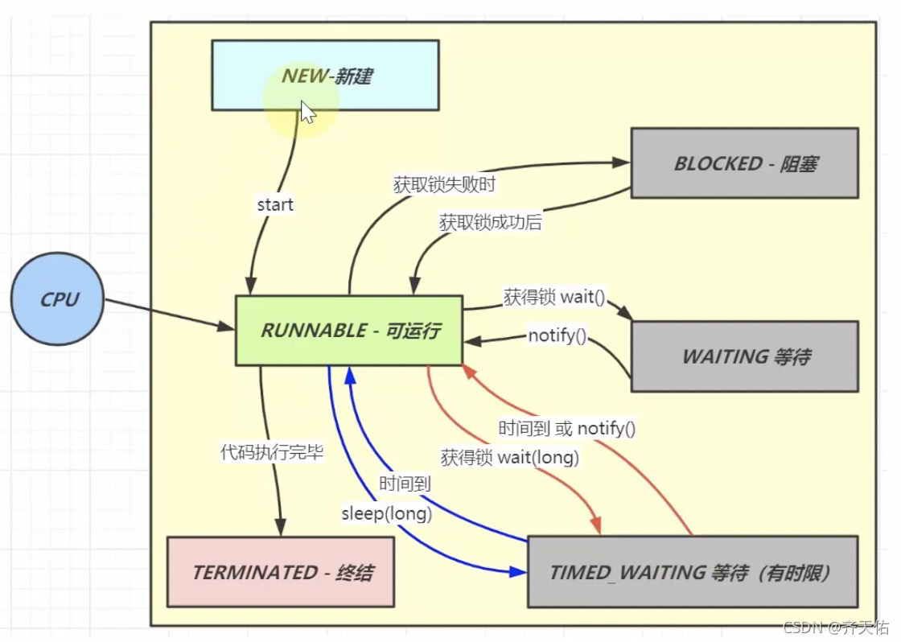
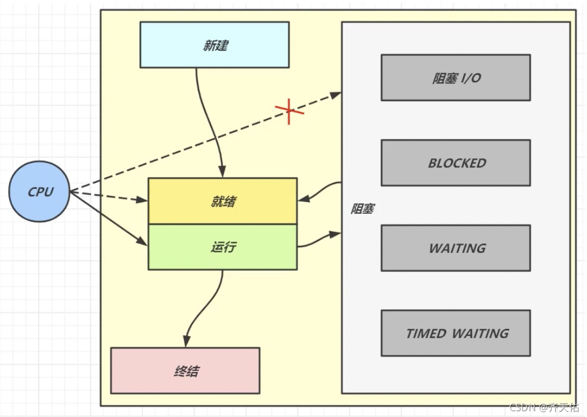
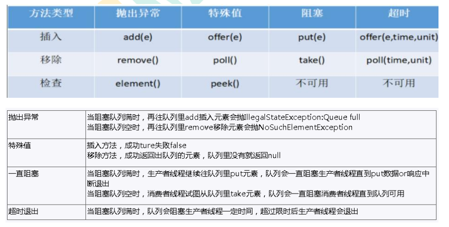

# 一、线程的基础知识
## 进程与线程
### 进程
1. 一个内存中运行的应用程序，每个进程都有自己独立的一块内存空间，即进程空间（虚空间），进程不依赖线程而独立存在，一个进程中可以启动多个线程；eg: windows系统中的 一个exe
2. 独立的内存单元
3. 独立的地址空间
4. 多个线程共享
5. 进程在执行过程中拥有独立的内存单元，而多个线程共享内存，从而极大地提高了程序的运行效率
### 线程
1. 定义
  - 进程中的一个执行流程，一个进程中可以运行多个线程
  - 线程总是属于某个进程
  - 线程没有自己的虚拟地址空间，与进程内的其他线程一起共享分配给该进程的所有资源    
  - 程序执行的最小单位
2. 包括的内容
  - 一个指向当前被执行指令的指令指针
  - 一个栈
  - 一个寄存器的集合:定义了一部分描述正在执行线程的处理器状态的值
  - 一个私有的数据区
### 协程
1. 是一种基于线程之上，但又比线程更加轻量级的存在，这种由程序员自己写程序来管理的轻量级线程叫做『用户空间线程』，具有对内核来说不可见的特性
## 线程的状态
1. java代码角度划分  
    > NEW,(新建)  
    > RUNNABLE,（准备就绪）  
    > BLOCKED,（阻塞）  
    > WAITING,（不见不散）  
    > TIMED_WAITING,（过时不候）  
    > TERMINATED;(终结)  

1. 操作系统层面划分  
    > 新建状态:creat  
    > 就绪状态:执行start（）方法  
    > 运行状态:系统调度，获取cpu资源，执行run（）方法   
    > 死亡状态:run()方法执行完成  
    > 阻塞状态:线程阻塞，让出CPU资源  

## 线程调度
1. 分时调度  
   所有线程轮流使用cpu的使用权，平均分配每个线程占用cpu的时间
2. 抢占式调度  
   优先级高的线程先使用CPU，如果优先级相同则随机选择一个
## 并发和并行
1. 串行是一次只能取得一个任务，并执行这个任务
2. 并发：同一时刻多个线程在访问同一个资源，多个线程对一个点;eg:春运抢票 电商秒杀
3. 并行：多项工作一起执行，之后再汇总;eg:泡方便面，电水壶烧水，一边撕调料倒入桶中
## 管程
1. Monitor，Java中叫锁，系统中叫监视器
2. 是一种同步机制，保证同一时间，只有一个线程访问被保护数据或者代码
## 用户线程和守护线程
1. 用户线程:平时用到的普通线程，自定义线程
2. 守护线程:运行在后台,是一种特殊的线程，比如垃圾回收线程
3. 主线程结束了，用户线程还在运行，jvm存活；没有用户线程了，都是守护线程，jvm结束

# 二、Synchronized 与 Lock
## Synchronized
1. synchronized作用范围
2. synchronized锁升级机制
## Lock
## Lock 和 synchronized 不同点
1. Lock 是一个接口，而 synchronized 是 Java 中的关键字，synchronized 是内
置的语言实现；
2. synchronized 在发生异常时，会自动释放线程占有的锁，因此不会导致死锁现
象发生；而 Lock 在发生异常时，如果没有主动通过 unLock()去释放锁，则很
可能造成死锁现象，因此使用 Lock 时需要在 finally 块中释放锁；
3. Lock 可以让等待锁的线程响应中断，而 synchronized 却不行，使用
synchronized 时，等待的线程会一直等待下去，不能够响应中断；
4. 通过 Lock 可以知道有没有成功获取锁，而 synchronized 却无法办到。
5. Lock 可以提高多个线程进行读操作的效率。

# 三、线程创建方式
## 继承Thread类，重写run()方法
    Thread t1 = new Thread() {
        @Override
        public void run() {
            log.info("{}", Thread.currentThread().getName());
        }
    };
    t1.setName("t1");
    t1.start();
## 实现Runnable接口，重写run()方法
    Thread t2 = new Thread(() -> log.info("{}", Thread.currentThread().getName()), "t2");
    t2.start();
## 实现Callable接口，重写call()方法并使用FutureTask获取call()方法的返回结果
    Thread t3 = new Thread(new FutureTask<Integer>(() -> {
        log.info("{}", Thread.currentThread().getName());
        return 1998;
    }), "t3");
    t3.start();
## 使用线程池
1. 一池N线程：Executors.newFixedThreadPool(int)
2. 一池一线程：Executors.newSingleThreadExecutor()
3. 线程池根据需求创建线程，可扩容，遇强则强：Executors.newCachedThreadPool()
4. newScheduledThreadPool，一个大小无限的线程池，线程池支持定时以及周期性执行任务的需求。
## 继承thread、实现Runnable、使用Callable接口 三种创建线程方式的对比
1. 采用实现Runnable、Callable接口的方式创建多线程时
    - 优势
      - 线程类只是实现了Runnable接口或Callable接口，还可以继承其他类。
在这种方式下，多个线程可以共享同一个target对象，所以非常适合多个相同线程来处理同一份资源的情况，从而可以将CPU、代码和数据分开，形成清晰的模型，较好地体现了面向对象的思想。
    - 劣势
      - 编程稍微复杂，如果要访问当前线程，则必须使用Thread.currentThread()方法
2. 使用继承Thread类的方式创建多线程时
    - 优势
      - 编写简单，如果需要访问当前线程，则无需使用Thread.currentThread()方法，直接使用this即可获得当前线程
    - 劣势
      - 线程类已经继承了Thread类，所以不能再继承其他父类
3. Runnable和Callable的区别
    - (1) Callable规定（重写）的方法是call()，Runnable规定（重写）的方法是run()。
    - (2) Callable的任务执行后可返回值，而Runnable的任务是不能返回值的。
    - (3) call方法可以抛出异常，run方法不可以。
    - (4) 运行Callable任务可以拿到一个Future对象，表示异步计算的结果。它提供了检查计算是否完成的方法，以等待计算的完成，并检索计算的结果。通过Future对象可以了解任务执行情况，可取消任务的执行，还可获取执行结果。

# 四、自定义线程池
## 线程池的七个参数
1. corePoolSize
2. maximumPoolSize
3. keepAliveTime
4. unit
5. workQueue(工作队列)
6. threadFactory(创建线程工厂)
7. **handler**(拒绝策略)
    - AbortPolicy（默认）: 丢弃任务，并抛出拒绝执行 RejectedExecutionException 异常信息
    - DiscardPolicy: 直接丢弃，其他啥都没有
    - CallerRunsPolicy: 当触发拒绝策略，只要线程池没有关闭的话，则使用调用线程直接运行任务
    - DiscardOldestPolicy: 当触发拒绝策略，只要线程池没有关闭的话，丢弃阻塞队列 workQueue 中最老的一个任务，并将新任务加入
## 线程池底层工作流程

## 集合的线程安全
1. ArrayList集合线程不安全
    - 解决方案-Vector
    - 解决方案-Collections
    - 解决方案-**CopyOnWriteArrayList(重点)**
2. HashSet线程不安全
    - 解决方案 CopyOnWriteArraySet
3. HashMap线程不安全
    - 解决方案 ConcurrentHashMap
## JUC辅助类
1. 减少计数CountDownLatch
    - 允许一个或者多个线程去等待其他线程完成操作
    - 举例：6个同学陆续离开教室之后，班长锁门
2. 循环栅栏CyclicBarrier
    - 和 CountDownLatch 非常类似，它也可以实现线程间的计数等待，但它的功能比 CountDownLatch 更加复杂且强大
    - 举例：集齐7颗龙珠就可以召唤神龙
4. 信号灯Semaphore
    - Semaphore可用于追踪可用资源的个数
    - 举例：6辆车三个车位
## ReentrantReadWriteLock读写锁

## BlockingQueue阻塞队列
1. 分类
    - ArrayBlockingQueue: 由数组结构组成的有界阻塞队列
    - LinkedBlockingQueue: 由链表结构组成的有界（但大小默认值为integer.MAX_VALUE）阻塞队列
ArrayBlockingQueue 和 LinkedBlockingQueue 是两个最普通也是最常用的阻塞队列，一般情况下，在处理多线程间的生产者消费者问题，使用这两个类足以
    - DelayQueue: 使用优先级队列实现的延迟无界阻塞队列
2. 核心方法
   
## 多线程常用方法

## 死锁

## 参考
    线程的面试题: https://www.cnblogs.com/lijun6/p/10542575.html