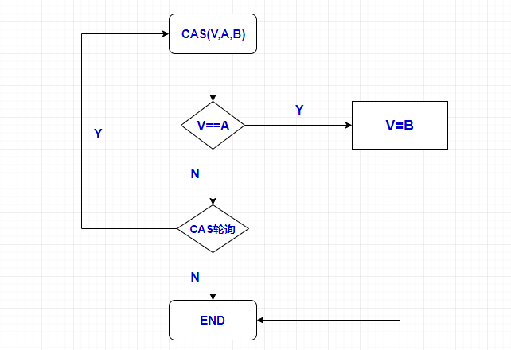

# 一、CAS的概念
1. CAS，全称Compare And Swap（比较与交换），解决多线程并行情况下使用锁造成性能损耗的一种机制。
2. CAS（V, A, B），V为内存地址、A为预期原值，B为新值。如果内存地址的值与预期原值相匹配，那么将该位置值更新为新值。否则，说明已经被其他线程更新，处理器不做任何操作；无论哪种情况，它都会在 CAS 指令之前返回该位置的值。而我们可以使用自旋锁，循环CAS，重新读取该变量再尝试再次修改该变量，也可以放弃操作。

# 二、CAS的产生
1. Volatile关键字可以保证线程间对于共享变量的可见性可有序性，可以防止CPU的指令重排序(DCL单例)，但是无法保证操作的原子性，所以jdk1.5之后引入CAS利用CPU原语保证线程操作的院子性。
2. CAS操作由处理器提供支持，是一种原语。原语是操作系统或计算机网络用语范畴。是由若干条指令组成的，用于完成一定功能的一个过程，具有不可分割性，即原语的执行必须是连续的，在执行过程中不允许被中断。如 Intel 处理器，比较并交换通过指令的 cmpxchg 系列实现。

# 三、CAS的原理探究
总结：根据资料查询，其实CAS底层实现根据不同的操作系统会有不同重载，CAS的实现离不开处理器的支持。
# 四、CAS机制的优缺点
1. 优点
    - cas是一种乐观锁，而且是一种非阻塞的轻量级的乐观锁，什么是非阻塞式的呢？其实就是一个线程想要获得锁，对方会给一个回应表示这个锁能不能获得。在资源竞争不激烈的情况下性能高，相比synchronized重量锁，synchronized会进行比较复杂的加锁，解锁和唤醒操作。
2. 缺点
    - 1）循环时间长开销大，占用CPU资源
    - 2）只能保证一个共享变量的原子操作
    - 3）ABA问题
3. 解决ABA问题
   - 1）添加版本号
   - 2）AtomicStampedReference

>java并发包为了解决这个问题，提供了一个带有标记的原子引用类“AtomicStampedReference”，它可以通过控制变量值的版本来保证CAS的正确性。因此，在使用CAS前要考虑清楚“ABA”问题是否会影响程序并发的正确性，如果需要解决ABA问题，改用传统的互斥同步可能会比原子类更高效。

# 五、CAS使用的时机
1. 线程数较少、等待时间短可以采用自旋锁进行CAS尝试拿锁，较于synchronized高效
2. 线程数较大、等待时间长，不建议使用自旋锁，占用CPU较高

### **参考:** 
[Java CAS底层实现原理实例详解](https://www.jb51.net/article/178206.htm)