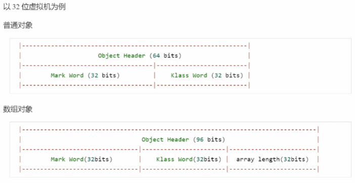
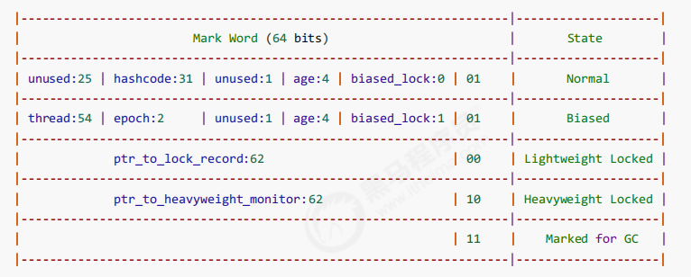

# 一、线程
1. 自定义线程七个参数
2. 线程状态及常用方法
3. 自定义线程池执行过程

# 二、Synchronized关键字
1. 线程八锁” 问题
2. Monitor
    - Java对象头（以32位虚拟机为例）
    
    - Mark word
    

### **参考:** 
[尚硅谷JUC课程](https://www.bilibili.com/video/BV1Kw411Z7dF)
[黑马程序员JUC课程](https://www.bilibili.com/video/BV16J411h7Rd)