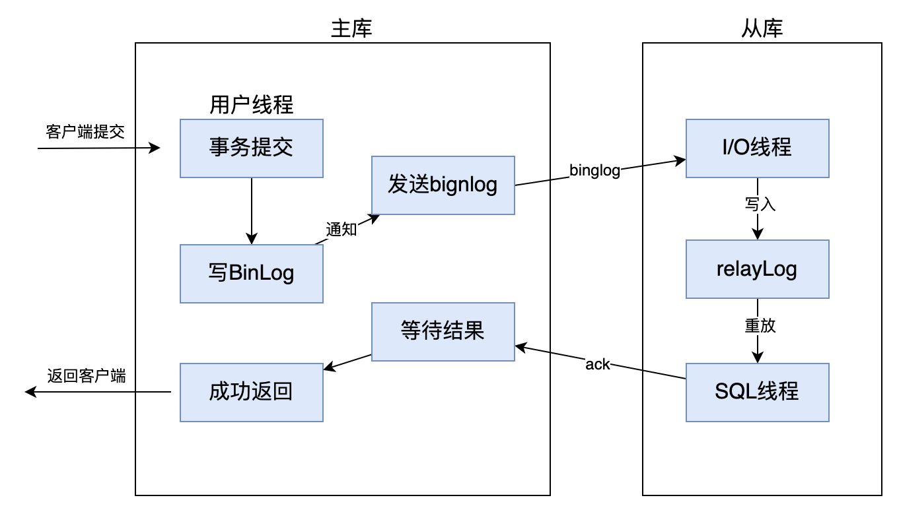
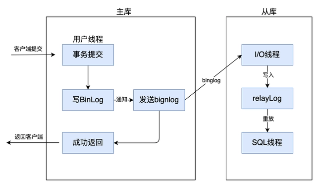
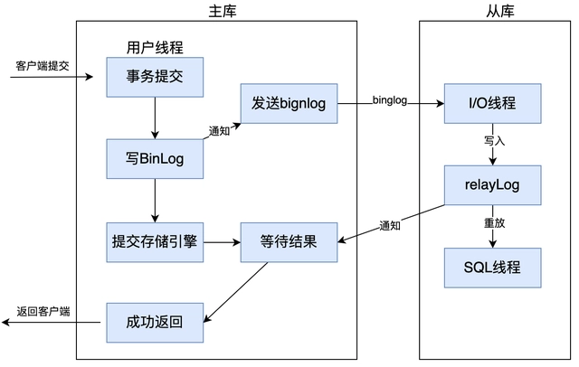
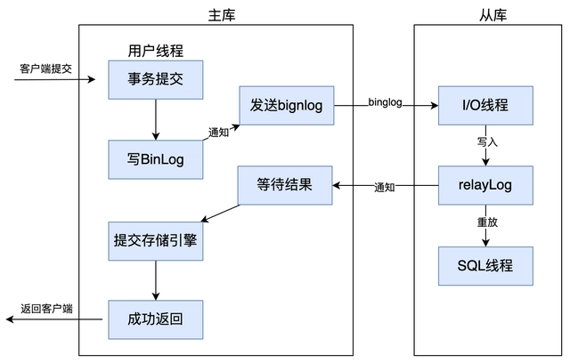

# 一、MySQL实际项目中优化
    1.建表时
        -1、适当使用冗余字段
        -2、字段尽量设置默认值，因为mysql针对NULL会做一些特殊的处理
        -3、有些字段可以用数值替代字符串
    2.建立索引时
        -1、不要建立重复索引
        -2、根据需求选择hash索引、B+tree索引
        -3、选择有标识度、有意义的字段建立索引
        -4、一张表索引并不是越多越好
    4.插入和更新时
        - 多条数据操作时，可选择批量操作比一条一条的更新速度更快，但最好在20-50条数据，超过超过效率骤减
    5.删除时
        - 删除大量数据时，最好做一下限制，因为有可能因为删除数据量太大，并且有索引存在，导致表锁
    6.查询时
        -1、连表不要太多，尽量不要超过5张表
        -2、尽量避免使用or
        -3、!=、IS NOT NULL有可能导致索引失效
        - 原则：最大化利用索引，尽可能避免全表扫描，减少无效数据的查询
    7.表的字符集保持一样

# 二、索引
1. 索引是一种用于快速查询和检索数据的数据结构。常见的索引结构有: B 树， B+树和 Hash。
2. 主键索引、二级索引（唯一索引、普通索引、前缀索引、全文索引等非主键索引） 
3. 聚簇索引和非聚簇索引
    - 聚簇索引：索引和数据存储在一起，找到索引就能直接找到数据，物理地址连续；
    - 非聚簇索引：索引和数据不存储在一起，需要通过索引回表得到数据，物理地址不连续；
    - 总的来说，聚集索引的叶节点就是数据节点。而非聚簇索引的叶节点仍然是索引节点，只不过有一个指针指向对应的数据块

# InnoDB引擎
    A - 原子性
    C - 一致性
    I - 隔离性
        - 读未提交（会出现脏读）
        - 读未提交（会出现脏读）
        - 可重复读（默认，会出现幻读）
          * MVCC➕Next-key-Lock 防止幻读
          * 有两种情况无法防止幻读
            1. 主动用 for share 或者 for update 这样带锁的 select 语句
            2. 开始较早的事务更新了 开始较晚但是结束较早的事务的新数据，那么开始较早的事务中会出现幻读	
        - 串行化
    D - 持久性

# MVCC
    1. 隐藏字段：记录事务ID 版本号等
    2. ReadView：主要是用来做可见性判断，里面保存了 “当前对本事务不可见的其他活跃事务”
    3. undo-log：
【参考】
[Innodb MVCC实现原理](https://zhuanlan.zhihu.com/p/52977862)

# 三大日志
    1. binlog（归档日志）
        - 保证了MySQL集群架构的数据一致性
    1. redo log（重做日志）
        - InnoDB存储引擎会使用redo log恢复数据（让InnoDB存储引擎拥有了崩溃恢复能力）
        - 保证事务的持久性
    2. undo log（回滚日志）
        - 所有事务进行的修改都会先记录到这个回滚日志中，然后再执行相关的操作
        - 保证事务的原子性
【参考】
[MySQL三大日志(binlog、redo log和undo log)详解](https://javaguide.cn/database/mysql/mysql-logs.html#redo-log)  

# MySQL为什么使用自增主键？
    1. 自增型主键有利于插入性能的提高
    2. 自增型主键设计(int,bigint)可以降低二级索引的空间，提升二级索引的内存命中率
    3. 自增型的主键可以减小page的碎片，提升空间和内存的使用
    4. 无主键的表删除，在row模式的主从架构，会导致备库夯住

1. MySQL什么版本？为什么升级到8？性能有提升？（答案不全面）
    - 1、性能峰值几乎是5.7的两倍
    - 2、可并行写入redo log，提升大量事务写入时的性能
    - 3、可在线调整redo log buffer和undo log相关设置
    - 4、自增列持久化，解决了服务重启后自增值回退的问题
    - 5、默认字符集为utf8mb4
    - 6、并行复制writeset机制，提升从库复制性能
2. MySQL主从同步问题
    - 全同步复制：主库写入binlog后强制同步日志到从库，所有的从库都执行完后才返回给客户端，性能会受到严重影响
        
    - 异步复制：
        
    - 半同步复制：和全同步不同的是，半同步复制是从库写入日志后返回ack确认给主库，主库只需要收到至少一个从库的确认就认为写操作完成
        
    - 增强半同步复制：mysql 5.7.2后，主库配置了参数 rpl_semi_sync_master_wait_point = AFTER_SYNC 后，主库在存储引擎提交事务前，必须先收到从库数据同步完成的确认信息后，才能提交事务，以此来解决幻读问题
         
3. MySQL引擎，InnoDB、MyISAM 两个搜索引擎区别，为什么用b+树
     二叉查找树(BST)：解决了排序的基本问题,但是由于无法保证平衡,可能退化为链表
     平衡二叉树(AVⅥL)：通过旋转解决了平衡的问题,但是旋转操作效率太低
     红黑树：通过舍弃严格的平衡和引入红黑节点，解决了 AⅥ旋转效率过低的问题，但是在磁盘等场景下，树仍然太高，IO 次数太多
     B 树：通过将二叉树改为多路平衡查找树，解决了树过高的问题
     B+树：在 B 树的基础上,将非叶节点改造为不存储数据的纯索引节点，进一步降低了树的高度；此外将叶节点使用指针连接成链表，
            范围查询更加高效。B+树叶节点之间只是逻辑相邻，而不是物理相邻，甚至在物理位置相邻很远的情况下，依然会产生很多的随机IO。
            B+树减少随机IO的关键在于，利用叶节点逻辑相邻的特性，尽可能地做到物理相邻(数据被分配到连续的页中)，使得在读取叶节点中的
            大量记录时可以使用顺序IO。这点很重要！