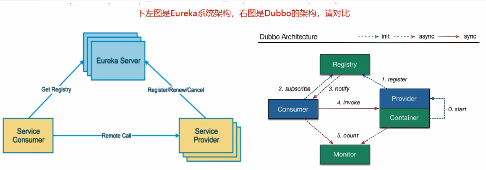

# 一、注册中心
## 服务治理
可以实现服务调用、负载均衡、容错等，实现服务发现与注册。
## 服务注册与发现
1. 在服务注册与发现中，有一个注册中心。
2. 当服务器启动时候，会把当前自己服务器的信息（eg:服务地址 通讯地址等以别名方式）注册到注册中心上。
3. 另一方（消费者|服务提供者），从注册中心获取到实际的服务通讯地址(以该别名的方式)，然后再实现本地RPC调用。
4. RPC远程调用框架核心设计思想：在于注册中心，因为便用注册中心管理每个服务与服务之间的一个依赖关系（服务治理概念)。在任何rpc远程框架中，都会有一个注册中心（存放服务地址相关信息（接口地址））
## CAP理论
1. **Consistency（一致性）**: 对于客户端的每次读操作，要么读到的是最新的数据，要么读取失败；强调的是数据正确。
2. **Availability（可用性）**: 任何客户端的请求都能得到响应数据，不会出现响应错误；我一定会给您返回数据，不会给你返回错误，但不保证数据最新，强调的是不出错。
3. **Partition tolerance（分区容忍性）**: 由于分布式系统通过网络进行通信，网络是不可靠的。当任意数量的消息丢失或延迟到达时，系统仍会继续提供服务，不会挂掉；强调的是不挂掉。

### Eureka（已停更）
1. Eureka包含两个组件：Eureka Server和Eureka Client
    - Eureka Server 提供服务注册服务
      - 各个微服务节点通过配置启动后，会在EurekaServer中进行注册，这样EurekaServer中的服务注册表中将会存储所有可用服务节点的信息，服务节点的信息可以在界面中直观看到。
    - Eureka Client 通过注册中心进行访问
      - 是一个Java客户端，用于简化Eureka Server的交互，客户端同时也具备一个内置的、使用轮询(round-robin)负载算法的负载均衡器。在应用启动后，将会向Eureka Server发送心跳(默认周期为30秒)。如果Eureka Server在多个心跳周期内没有接收到某个节点的心跳，EurekaServer将会从服务注册表中把这个服务节点移除（默认90秒）
2. 单机Eureka构建

3. 集群Eureka构建

Ribbon和Eureka整合后，消费者可以直接调用服务而不用再关心地址和端口号，且该服务还有负载功能。

4. actuator微服务信息完善

5. 服务发现Discovery
   - 主启动类添加注解：@EnableDiscoveryClient
6. Eureka自我保护
    - 自我保护模式是一种应对网络异常的安全保护措施。它的架构哲学是宁可同时保留所有微服务（健康的微服务和不健康的微服务都会保留）也不盲目注销任何健康的微服务。使用自我保护模式，可以让Eureka集群更加的健壮、稳定。
    - 某时刻某一个微服务不可用了，Eureka不会立刻清理，依旧会对该微服务的信息进行保存，属于CAP里面的AP分支
    - 自我保护机制默认是开启的 eureka.server.enable-self-preservation=true，设置为 false 可以禁用自我保护模式

### Zookeeper
Zookeeper是一个分布式协调工具，可以实现注册中心功能

### Consul
1. Consul简介
   - Consul 是一套开源的分布式服务发现和配置管理系统，提供了微服务系统中的服务治理、配置中心、控制总线等功能。这些功能中的每一个都可以根据需要单独使用，也可以一起使用以构建全方位的服务网格，总之Consul提供了一种完整的服务网格解决方案。
   - 优点：基于 raft 协议，比较简洁； 支持健康检查, 同时支持 HTTP 和 DNS 协议 支持跨数据中心的 WAN 集群 提供图形界面 跨平台，支持 Linux、Mac、Windows。
2. 提供功能
   - 服务发现：提供HTTP和DNS两种发现方式
   - 健康监测：支持多种方式，HTTP、TCP、Docker、Shell脚本定制化监控
   - KV存储：Key、Value的存储方式
   - 多数据中心：Consul支持多数据中心
   - 可视化Web界面

# 二、服务调用
## Ribbon
1. Ribbon简介
   - Spring Cloud Ribbon是基于Netflix Ribbon实现的一套客户端**负载均衡**的工具。主要功能是**提供客户端的软件负载均衡算法和服务调用**。Ribbon客户端组件提供一系列完善的配置项如连接超时，重试等。
2. 提供功能
    - LB负载均衡(Load Balance)
    - Ribbon本地负载均衡客户端 VS Nginx服务端负载均衡区别
      - Nginx是服务器负载均衡，客户端所有请求都会交给nginx，然后由nginx实现转发请求。即负载均衡是由服务端实现的
      - Ribbon是本地负载均衡，在调用微服务接口时候，会在注册中心上获取注册信息服务列表之后缓存到JVM本地，从而在本地实现RPC远程服务调用技术
3. Ribbon负载均衡
    - 1.先选择 EurekaServer ,它优先选择在同一个区域内负载较少的server
    - 2.再根据用户指定的策略，从server取到的服务注册列表中选择一个地址；其中Ribbon提供了多种策略：比如轮询、随机和根据响应时间加权
    > 总结：Ribbon其实就是一个软负载均衡的客户端组件，他可以和其他所需请求的客户端结合使用，和eureka结合只是其中的一个实例。

4. Ribbon核心组件IRule
    - IRule接口实现类说明
      - com.netflix.loadbalancer.RoundRobinRule：轮询
      - com.netflix.loadbalancer.RandomRule：随机
      - com.netflix.loadbalancer.RetryRule：先按照RoundRobinRule的策略获取服务，如果获取服务失败则在指定时间内会进行重试，获取可用的服务
      - WeightedResponseTimeRule：对RoundRobinRule的扩展，响应速度越快的实例选择权重越大，越容易被选择
      - BestAvailableRule：会先过滤掉由于多次访问故障而处于断路器跳闸状态的服务，然后选择一个并发量最小的服务
      - AvailabilityFilteringRule：先过滤掉故障实例，再选择并发较小的实例
      - ZoneAvoidanceRule：默认规则,复合判断server所在区域的性能和server的可用性选择服务器
    - Ribbon负载规则替换
1. Ribbon负载均衡算法
    - 原理
      - 负载均衡算法：rest接口第几次请求数 % 服务器集群总数量 = 实际调用服务器位置下标  ，每次服务重启动后rest接口计数从1开始。

## OpenFeign
1. OpenFeign简介
    - Feign是一个声明式WebService客户端，使用Feign能让编写Web Service客户端更加简单。
    - 使用方法是定义一个服务接口然后在上面添加注解。
    - Feign可以与Eureka和Ribbon组合使用以支持负载均衡
    - [GitHub](https://github.com/spring-cloud/spring-cloud-openfeign)
    - [官网解释](https://cloud.spring.io/spring-cloud-static/Hoxton.SR1/reference/htmlsingle/#spring-cloud-openfeign)
2. 功能
    - Feign集成了Ribbon，利用Ribbon维护了微服务提供者的服务列表信息，并且通过轮询实现了客户端的负载均衡。
    - 与Ribbon不同的是，通过feign只需要定义服务、绑定接口且以声明式的方法，优雅而简单的实现了服务调用
3. Feign和OpenFeign两者区别
    - Feign：
      - Feign是Spring Cloud组件中的一个轻量级RESTful的HTTP服务客户端
      - Feign内置了Ribbon，用来做客户端负载均衡，去调用服务注册中心的服务
      - Feign的使用方式是：使用Feign的注解定义接口，调用这个接口，就可以调用服务注册中心的服务
    - OpenFeign：
      - OpenFeign是Spring Cloud 在Feign的基础上支持了SpringMVC的注解，如@RequesMapping等等
      - OpenFeign 的 @FeignClient 可以解析 SpringMVC 的 @RequestMapping 注解下的接口，并通过动态代理的方式产生实现类，实现类中做负载均衡并调用其他服务
4. OpenFeign使用
    - 接口+注解：微服务调用接口+@FeignClient
5. OpenFeign超时控制
    - Openfeign默认超时等待为一秒，在消费方80配置超时时间
     
   >#设置feign客户端超时时间(OpenFeign默认支持ribbon)
    ribbon:
        #指的是建立连接所用的时间，适用于网络状况正常的情况下,两端连接所用的时间
        ReadTimeout: 5000
        #指的是建立连接后从服务器读取到可用资源所用的时间
        ConnectTimeout: 5000
6. OpenFeign开启日志
7. Feign 提供了日志打印功能，我们可以通过配置来调整日志级别，从而了解 Feign 中 Http 请求的细节。说白了就是对Feign接口的调用情况进行监控和输出
8. 日志级别
    - NONE：默认的，不显示任何日志
    - BASIC：仅记录请求方法、URL、响应状态码及执行时间
    - HEADERS：除了 BASIC 中定义的信息之外，还有请求和响应的头信息
    - FULL：除了 HEADERS 中定义的信息之外，还有请求和响应的正文及元数据

# 三、服务降级
## Hystrix（已停更）
1. Hystrix简介
   - Hystrix是一个用于**处理分布式系统的延迟和容错的开源库**，在分布式系统里，许多依赖不可避免的会调用失败，比如超时、异常等
   - Hystrix能够**保证在一个依赖出问题的情况下，不会导致整体服务失败，避免级联故障，以提高分布式系统的弹性**。
   - “断路器”本身是一种开关装置，当某个服务单元发生故障之后，通过断路器的故障监控（类似熔断保险丝），向调用方返回一个符合预期的、可处理的备选响应（FallBack），而不是长时间的等待或者抛出调用方无法处理的异常，这样就保证了服务调用方的线程不会被长时间、不必要地占用，从而避免了故障在分布式系统中的蔓延，乃至雪崩。
2. Hystrix功能
    - 服务降级
      - 服务器忙，请稍后再试，不让客户端等待并立刻返回一个友好提示，fallback
      - 哪些情况会出发降级？
        - 程序运行异常
        - 超时
        - 服务熔断触发服务降级
        - 线程池/信号量打满也会导致服务降级
    - 服务熔断
      - 类比保险丝达到最大服务访问后，直接拒绝访问，拉闸限电，然后调用服务降级的方法并返回友好提示
      - 就是保险丝：服务的降级->进而熔断->恢复调用链路
    - 服务限流
      - 秒杀活动等高并发操作，严禁一窝蜂的过来拥挤，大家排队，一秒钟N个，有序进行
    - 接近实时的监控等
    - 官网资料：https://github.com/Netflix/Hystrix/wiki/How-To-Use
    - Hystrix官宣，停更进维：https://github.com/Netflix/Hystrix
3. 服务降级
    - 服务端降级
    - 消费端降级
4. 服务熔断
    - 1.熔断介绍
      - 熔断机制是**应对雪崩效应的一种微服务链路保护机制**，当扇出链路的某个微服务出错不可用或者响应时间太长时，会进行服务的降级，进而熔断该节点微服务的调用，快速返回错误的响应信息，当检测到该节点微服务调用响应正常后，恢复调用链路。
      - 在Spring Cloud框架里，熔断机制通过Hystrix实现。Hystrix会监控微服务间调用的状况，当失败的调用到一定阈值，缺省是5秒内20次调用失败，就会启动熔断机制。熔断机制的注解是@HystrixCommand
    - 2.断路器起作用的三个重要参数: 快照时间窗、请求总数阀值、错误百分比阀值
      - 快照时间窗：断路器确定是否打开需要统计一些请求和错误数据，而统计的时间范围就是快照时间窗，默认为最近的10秒。
      - 请求总数阀值：在快照时间窗内，必须满足请求总数阀值才有资格熔断。默认为20，意味着在10秒内，如果该hystrix命令的调用次数不足20次，即使所有的请求都超时或具他原因失败，断路器都不会打开。
      - 错误百分比阀值：当请求总数在快照时间窗内超过了阀值，假设发生了30次调用，在这30次调用中，有15次发生了超时异常，也就是超过50％的错误百分比，在默认设定50％阀值情况，这时候就会将断路器打开。
    - 3. 断路器开启或者关闭的条件
      - 当满足一定的阀值的时候（默认10秒内超过20个请求次数）
      - 当失败率达到一定的时候（默认10秒内超过50%的请求失败）
      - 到达以上阀值，断路器将会开启
      - 当开启的时候，所有请求都不会进行转发
      - 一段时间之后（默认是5秒），这个时候断路器是半开状态，会让其中一个请求进行转发；如果成功，断路器会关闭；若失败，继续开启。重复4和5
    - 4. **断路器打开之后，再有请求调用的时候，将不会调用主逻辑，而是直接调用降级fallback**，通过断路器，实现了自动地发现错误并将降级逻辑切换为主逻辑，减少响应延迟的效果
    - 5. 主逻辑如何恢复
      - 对于这一问题，hystrix也为我们实现了自动恢复功能。
      - 当断路器打开，对主逻辑进行熔断之后，hystrix会启动一个休眠时间窗，在这个时间窗内，降级逻辑是临时的成为主逻辑，当休眠时间窗到期，断路器将进入半开状态，释放一次请求到原来的主逻辑上，如果此次请求正常返回，那么断路器将继续闭合，主逻辑恢复；如果这次请求依然有问题，断路器继续进入打开状态，休眠时间窗重新计时。
    - 6. @HystrixCommand所有配置（查看参考）
5. 服务限流

6. 服务监控hystrixDashboard
    - Hystrix除了隔离依赖服务的调用以外，还提供了**准实时的调用监控（Hystrix Dashboard）**
    - pom:spring-cloud-starter-netflix-hystrix-dashboard; 主启动类加上这个注解：@EnableHystrixDashboard
    - pom:spring-boot-starter-actuator; 微服务提供主启动类上加 @EnableCircuitBreaker，用于对豪猪熔断机制的支持

# 四、服务网关
## Gateway
1. 官网
    - 上一代zuul 1.X：https://github.com/Netflix/zuul/wiki
    - 当前gateway：https://cloud.spring.io/spring-cloud-static/spring-cloud-gateway/2.2.1.RELEASE/reference/html/
2. Gateway简介
    - SpringCloud Gateway是SpringCloud的一个全新项目
    - **旨在为微服务架构提供一种简单有效的统一的API路由管理方式。**
    - SpringCloud Gateway是基于WebFlux框架实现的，而**WebFlux是一个典型非阻塞异步框架**，底层则使用了高性能的Reactor模式通信框架Netty。目的是为了提升网关的性能。
3. 提供功能
    - 反向代理
    - 鉴权
    - 流量控制
    - 熔断
    - 日志监控

4. Gateway特征
    - 基于Spring Framework 5, Project Reactor 和 Spring Boot 2.0 进行构建
    - 动态路由：能够匹配任何请求属性
    - 可以对路由指定 Predicate（断言）和 Filter（过滤器）
    - 集成Hystrix的断路器功能
    - 集成 Spring Cloud 服务发现功能
    - 易于编写的 Predicate（断言）和 Filter（过滤器）
    - 请求限流功能
    - 支持路径重写
5. **Gateway工作流程**
    - ①三大核心概念
      - （1）Route(路由)：路由是构建网关的基本模块，它由ID，目标URI，一系列的断言和过滤器组成，如果断言为true则匹配该路由
      - （2）Predicate(断言)：参考的是Java8的java.util.function.Predicate，开发人员可以匹配HTTP请求中的所有内容(例如请求头或请求参数)，如果请求与断言相匹配则进行路由
      - （3）Filter(过滤)：指的是Spring框架中GatewayFilter的实例，使用过滤器，可以在请求被路由前或者之后对请求进行修改。
    - ②Gateway工作流程
      - 核心逻辑：路由转发+执行过滤器链
    

6. 代码实现操作
    - 查看参考[SpringCloud笔记 - Gateway网关](https://blog.csdn.net/qq_51409098/article/details/125925820)
7. 通过微服务名实现动态路由
    - 默认情况下gateway会根据注册中心注册的服务列表，以注册中心上微服务名为路径创建动态路由进行转发，从而实现动态路由的功能。

# 五、服务配置
## Config分布式配置中心
1. Config简介
    - SpringCloud Config为微服务架构中的微服务提供集中化的外部配置支持，配置服务器为各个不同微服务应用的所有环境提供了一个**中心化的外部配置**。
    - SpringCloud Config分为 服务端 和 客户端 两部分
      - 服务端也称为分布式配置中心，它是一个独立的微服务应用，用来连接配置服务器并为客户端提供获取配置信息，加密/解密信息等访问接口
      - 客户端则是通过指定的配置中心来管理应用资源，以及与业务相关的配置内容，并在启动的时候从配置中心获取和加载配置信息，配置服务器默认采用git来存储配置信息，这样就有助于对环境配置进行版本管理，并且可以通过git客户端工具来方便的管理和访问配置内容。
2. 提供功能
    - 集中管理配置文件
    - 不同环境不同配置，动态化的配置更新，分环境部署比如dev/test/prod/beta/release
    - 运行期间动态调整配置，不再需要在每个服务部署的机器上编写配置文件，服务会向配置中心统一拉取配置自己的信息
    - 当配置发生变动时，服务不需要重启即可感知到配置的变化并应用新的配置
    - 将配置信息以REST接口的形式暴露：post、curl访问刷新均可…
3. Config配置总控中心实现
    - 查看参考[SpringCloud笔记 - Config分布式配置中心](https://blog.csdn.net/qq_51409098/article/details/125927940)

# 六、服务总线
## Bus消息总线
1. Spring Cloud Bus 配合 Spring Cloud Config 使用可以实现配置的动态刷新
2. Bus简介
    - 
    -  Spring Cloud Bus是用来将分布式系统的节点与轻量级消息系统链接起来的框架，它整合了Java的事件处理机制和消息中间件的功能。
    -  Spring Cloud Bus目前支持RabbitMQ和Kafka。
3. 提供功能
    - Spring Cloud Bus能管理和传播分布式系统间的消息，就像一个分布式执行器，可用于广播状态更改、事件推送等，也可以当作微服务间的通信通道。
4. 总线
    - 1.总线概念
      - 在微服务架构的系统中，**通常会使用轻量级的消息代理来构建一个共用的消息主题，并让系统中所有微服务实例都连接上来。由于该主题中产生的消息会被所有实例监听和消费，所以称它为消息总线。**
    - 2.基本原理
      - ConfigClient实例都监听MQ中同一个topic(默认是springCloudBus)。**当一个服务刷新数据的时候，它会把这个信息放入到Topic中，这样其它监听同一Topic的服务就能得到通知，然后去更新自身的配置。**
3. Bus消息总线实现
    -  - 查看参考[SpringCloud笔记 - Bus消息总线](https://blog.csdn.net/qq_51409098/article/details/125928671)

# 七、Springboot Actuator
1. 监控中心是针对微服务期间
    - 查看服务器内存变化(对内存,线程,日志管理等)
    - 检测服务配置连接池地址是否可用(模拟访问,懒加载)
    - 统计现在有多个bean(是Spring容器中的bean)
    - 统计SpringMVC@RequestMapping(统计http接口)
> 使用Actuator来查看这些信息,它是没有界面的返回的是json格式的数据 
AdminUi底层使用的是Actuator实现的,只不过给它加了个可视化界面
2. 在应用程序生产环境时
    - 监控和管理应用程序
    - 可使用Http的各种请求来监管、审计、收集应用的运行情况
3. 如何使用

# 八、SpringCloud Alibaba组件

### **参考**
[SpringCloud视频](https://www.bilibili.com/video/BV18E411x7eT)  
[SpringCloud笔记](https://blog.csdn.net/qq_51409098/article/details/126085938)